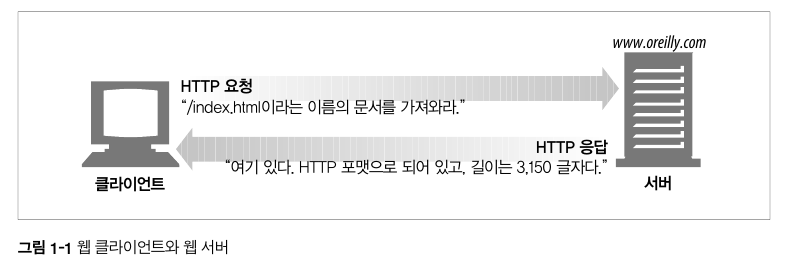

# 1.1 HTTP: 인터넷 멀티미디어 배달부
- HTTP는 다양한 종류 데이터 유형이자 막대한 데이터를 웹브라우저로 전달해요.
- 그리고 신뢰성 있는 데이터 전송 프로토콜을 사용하고 있습니다. 따라서 전송 중 데이터가 손상되거나 꼬이지 않음을 보장한다는 특징이 있습니다.
- 따라서 이로인해 개발자들이 애플리케이션 고유의 기능 구현에 좀 더 집중할 수 있죠.

# 1.2 웹 클라이언트와 서버 
- 웹 클라이언트는 웹 컨텐츠를 가진 웹 서버에 데이터를 요청하고 웹서버 (HTTP 서버)는 요청한 데이터를 HTTP 응답으로 제공합니다.

- 예를 들어보죠. 위에 이미지처럼 [`https://www.oreilly.com/index.html`](https://www.oreilly.com/index.html) 페이지를 열어볼 때,
  - 웹브라우저는 HTTP 요청을 [`https://www.oreilly.com`](https://www.oreilly.com) 서버로 보내구요.
  - 서버는 요청 받은 객체(이 경우 `/index.html`)을 찾고,
  - 이 과정이 성공했다면 타입, 길이 등의 정보를 HTTP 응답에 실어서 클라이언트에게 보냅니다.

# 1.3 리소스 
- 웹 서버는 웹 리소스를 관리하고 제공합니다.
- 웹 리소스의 가장 단순한 형태는 웹 서버 파일 시스템의 정적 파일(텍스트 파일, HTML 파일, 이미지 등)이에요.
- 사용자의 요구에 따라 동적 리소스도 웹 리소스의 일종이 될 수 있죠.

## 1.3.1 미디어 타입
- HTTP에서 전송 데이터 타입을 라벨링하기 위해서 MIME를 사용합니다. 
- 여기서 잠깐, MIME(Multipurpose Internet Mail Extensions)란?
  - 클라이언트에게 전송된 문서의 다양성을 알려주기 위한 메커니즘이에요.
  - 웹에서 파일의 확장자는 별 의미가 없기때문에 올바른 MIME 타입을 전송하도록 서버에서 정확하게 설정하는 것이 중요합니다.
  - 브라우저는 리소스를 내려받았을때 해야할 기본 동작이 무엇인지 결정하기 위해 대게 MIME 타입을 사용합니다.
  - 이게 원래는 전자메일 시스템에서 메시지가 오갈때 겪는 문제점을 해결하기 위해 설계됐다고 해요.
  - 이메일에서 잘 동작하여 HTTP에서도 멀티미디어 콘텐츠를 기술하고 라벨을 붙이기 위해 채택했습니다.
- 웹 서버는 HTTP 객체 데이터에 MIME 타입을 붙여 전송해요.

## 1.3.2 URI
- URI (uniform resorce identifier)는 웹 리소스의 이름과 같아서 고유하게 식별하고 위치를 지정할 수 있습니다. 
- URI의 종류는 크게 두가지가 있습니다.
	- URL 
	- URN 

아래 이미지는 URI의 구성을 설명할때 많이 사용되는 집합 그림입니다.


## 1.3.3 URL
- URL(Uniform Resource Locator, 통합 자원 지시자)은 특정 서버의 한 리소스에 대한 구체적인 위치를 서술하구요.
- 리소스가 정확히 어디에 있고 어떻게 접근할 수 있는지 분명하게 알려줘요.

```
// URL의 형태
{scheme(protocol)}://{host}:{port}/{path}?{query param}
```


## 1.3.4 URN
- URN (Uniform Resource Name)은 리소스의 위치에 영향 받지 않는 유일무이한 이름 역할을 합니다. 
- 즉, 리소스르 옮기더라도 문제없이 동작해요. 
- 아직 널리 채택되지 않는다고 하네요. 
  - 저도 카더라도 듣긴한건데 도서관에서 사용한다고 합니다. 몇번 책장에 몇줄에 위치해있고....

```
// URN의 형태
urn:ietf:rfc:2141
```

# 1.4 트랜잭션 
- 요청 명령과 응답 결과로 구성되어 있습니다.
- 트랜잭션이란? 데이터베이스나 시스템에서 여러 작업을 하나의 논리적 단위로 묶어 처리하는 것을 의미합니다. HTTP에서는 요청 명령, 응답 결과에 따른 작업들을 묶어서 구성하는것을 의미하는걸로 보이네요.
  - 저같은 경우는 IndexedDB와 같은 Web API를 사용했을때에만 접해봤던 용어라서 한번 정리해봅니다.

## 1.4.1 메서드 
- HTTP 요청은 한 개의 메서드 가지구요, 서버가 어떤 동작을 해야하는지 알려줍니다. 

| HTTP 메서드 | 설명                                                                |
| ----------- | ------------------------------------------------------------------- |
| GET         | 서버에서 클라이언트로 지정한 리소스를 보내줘                        |
| PUT         | 클라이언트에서 서버로 보낸 데이터를 지정한 이름의 리소스로 저장해 |
| DELETE      | 지정한 리소스를 서버에서 삭제해해                                   |
| POST        | 클라이언트 데이터를 서버 게이트웨이 애플리케이션으로 보내         |
| HEAD        | 지정한 리소스에 대한 응답에서 HTTP 헤더 부분만 보내               |
# 1.4.2 상태코드 
- 클라이언트에게 요청 성공했는지 알 수 있는 세 자리 숫자입니다.
- 상태 코드와 함께 전달되는 사유 구절은 설명하기 위한 용도에요. 웹개발을 하시는 분들이라면 너무나 익숙하죠. 

# 1.4.3 웹 페이지는 여러 객체로 이루질 수 있다. 
- 여러 HTTP 트랜잭션을 수행하여 시각적으로 다양한 웹페이지를 취할 수 있습니다. 


# 1.5 메시지 
- HTTP는 단순 줄 단위 텍스트로 구성되어 있어요. 사람도 읽고 쓰기 쉽다(?)라는 특징이 있습니다. 
- 메시지는 크게 시작줄, 헤더, 본문으로 구성되어 있어요. 


## 1.5.1 간단한 메시지의 예


# 1.6 TCP 커넥션
## 1.6.1 TCP/IP
- HTTP는 어플리케이션 계층 프로토콜로 네트워크 통신의 세부 사항에 관여하지 않습니다.
- 대신 TCP 프로토콜이 네트워크 계층을 담당하구요. 특징은 아래와 같아요. 
	- 오류 없는 데이터 전송
	- 순서에 맞는 전달
	- 조각나지 않는 데이터 스트림 
- TCP/IP는 각 네트워크와 하드웨어의 특성을 숨기고, 어떤 종류의 컴퓨터나 네트워크든 서로 신뢰성 있는 의사소통을 하게 해줍니다.

## 1.6.2 접속, IP 주소 그리고 포트번호
- 인터넷 프로토콜 주소인 IP와 서버에서 사용하는 프로그램이 사용중인 포트 번호를 조합하여서 TCP연결이 가능합니다. 
- IP 주소를 알지 못해도 DNS가 서버 이름 IP로 변환해줘요. 기본 포트 번호는 80이에요. 

> 어떻게 서버의 IP 주소와 포트번호를 알 수 있을까요?

- URL을 이용하면 된다고 하네요.
  - URL은 리소스에 대한 주소(위치)에요.
  ```
  http://207.200.83.29:80/index.html
  http://www.netscape.com/index.html
  ```
  - 첫번째 URL은 IP 주소 207.200.83.29 와 포트번호 80을 갖고 있습니다.
  - 두번째 URL은 IP 주소가 없어요. → 호스트명인 `www.netscape.com`를 DNS로 하여금 IP 주소로 변환할 수 있어요.

# 1.7 프로토콜 버전 
짧게 넘어가겠습니다.
### HTTP/0.9
- 프로토타입 버전 
- GET 메소드만 지원 
- 멀티미디어 컨텐츠 지원 X

### HTTP/1.0 
- 버전 번호, 헤더, 추가 메서드, 멀미미디어 객체 처리 추가 
- 웹페이지와 상호작용 폼 가능 

### HTTP/1.0+ 
- keep-alive 커넥션, 가상 호스팅 지원, 프락시 연결 지원 

### HTTP/1.1 
- HTTP 설계 구조적 결함 교정
- 성능 최적화
- 잘못된 기능을 제거

### HTTP/2.0 
- 구글의 SPDY 프로토콜 기반 

# 1.8 웹의 구성요소 

## 1.8.1 프락시

- 클라이언트와 서버 사이에 위치한 HTTP 중개자에요.
- 웹 보안, 애플리케이션 통합, 성능 최적화를 위한 요소입니다.
- 클라이언트와 서버 사이에 위치하여 클라이언트의 모든 요청을 받아 서버로 전달해요.
  - 요청을 수정하여 서버에 전달할수도 있고,
  - 요청과 응답을 필터링할수도 있습니다.


## 1.8.2 캐시

- 많이 찾는 웹페이지를 클라이언트 가까이에 보관하는 HTTP 창고에요.
- 웹캐시와 캐시 프락시는 자신을 거쳐가는 문서들 중 자주 찾는 것의 사본을 저장해 두는, 특별한 종류의 HTTP 프락시 서버입니다.(ex - CDN 서버, Amazon CloudFront)
- 클라이언트는 멀리 떨어진 웹 서버보다 근처의 캐시에서 훨씬 빨리 문서를 다운받을 수 있습니다.


## 1.8.3 게이트웨이

- 다른 애플리케이션과 연결된 특별한 웹 서버입니다.
- 게이트웨이는 주로 HTTP 트래픽을 다른 프로토콜로 변환하기 위해 사용됩니다.
- 게이트웨이는 언제나 스스로가 리소스를 갖고 있는 진짜 서버인 것처럼 요청을 다룬다고 합니다. 이렇게하면 클라이언트는 게이트웨이와 통신하고 있음을 알아채지 못할 것이라네요.


## 1.8.4 터널

- 단순히 HTTP 통신을 전달하기만 하는 특별한 프락시입니다.
- 터널은 두 커넥션 사이에 raw data를 열어보지 않고 그대로 전달해주는 HTTP 애플리케이션입니다.
- HTTP 터널은 주로 비 HTTP 데이터를 하나 이상의 HTTP 연결을 통해 그대로 전송해주기 위해 사용됩니다.


## 1.8.5 에이전트

- 자동화된 HTTP 요청을 만드는 semi-intelligent 웹 클라이언트입니다.
- 웹 요청을 만드는 애플리케이션은 뭐든 HTTP 에이전트라고합니다.
- 웹 브라우저도 HTTP 에이전트의 한 종류이구요.