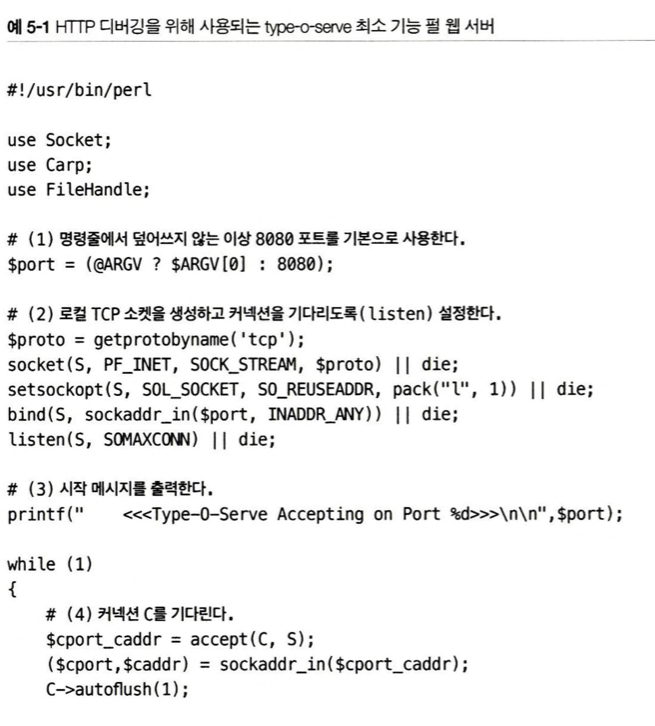
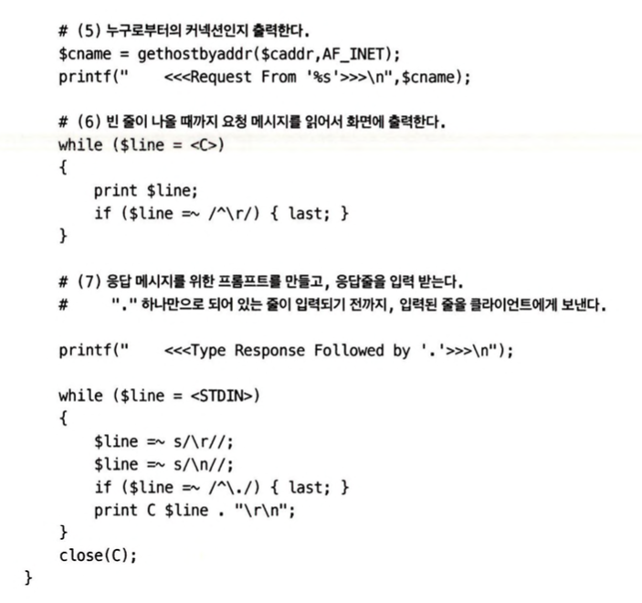
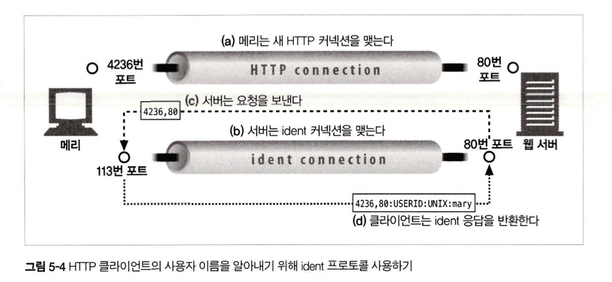
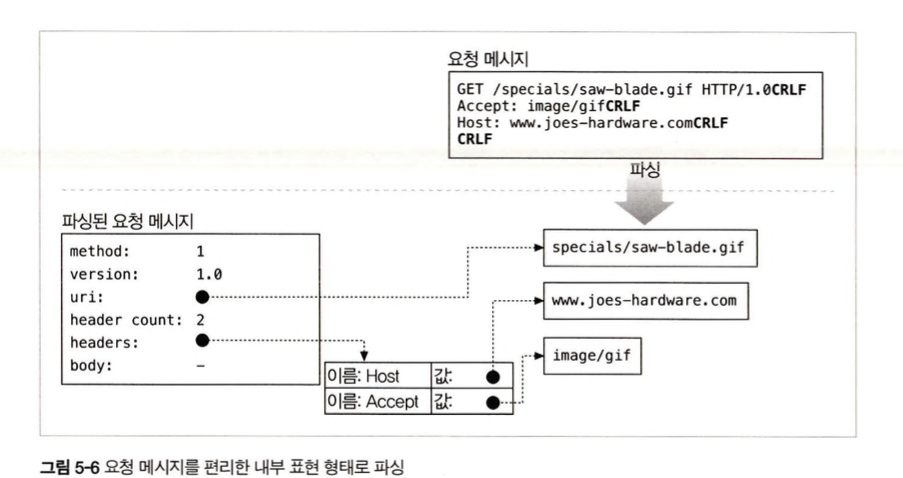
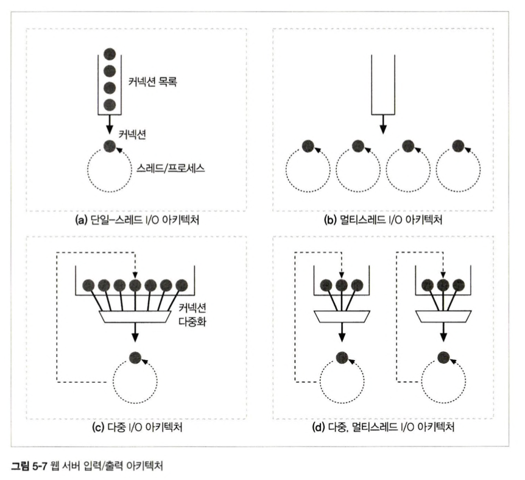
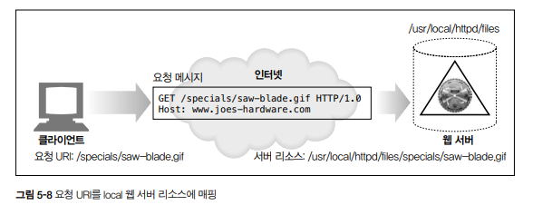
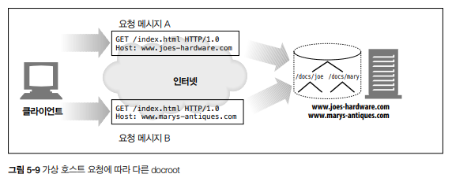

# 5장 웹 서버

이번 장에서는 다음과 같은 내용을 다루게 됩니다.

* 여러 종류의 소프트웨어 및 하드웨어 **웹 서버**에 대하여 조사합니다.
* **HTTP 통신을 진단**해주는 간단한 웹 서버를 **Perl**로 작성해봅니다.
* 웹 서버가 HTTP 트랜잭션을 처리하는 과정을 **단계별로 설명**드립니다.

## 5.1 다채로운 웹 서버

웹 서버는 HTTP 요청을 처리하고 응답을 제공합니다. "웹 서버"라는 용어는 웹 서버 소프트웨어와 웹페이지 제공에 특화된 장비(컴퓨터와 같은) 양쪽 모두를 가리킵니다.

웹 서버는 기능, 형태, 크기가 모두 다양합니다. 기능은 달라도 모든 웹 서버는 리소스에 대한 **HTTP 요청**을 받아서 **콘텐츠를 클라이언트에게 돌려줍니다**.

### 5.1.1 웹 서버 구현

* **웹 서버란 무엇일까요?**
    웹 서버는 HTTP 및 그와 관련된 TCP 처리를 구현한 것입니다. 자신이 제공하는 리소스를 관리하며, 웹 서버 관리 기능 또한 제공합니다.
* **웹 서버와 운영체제의 관계**
    웹 서버는 HTTP 프로토콜 구현, 웹 리소스 관리, 웹 서버 관리 기능 제공, TCP 커넥션 관리를 **운영체제와 나누어 가집니다**. 운영체제는 시스템 하드웨어 관리, TCP/IP 네트워크 지원, 웹 리소스에 대한 파일 시스템, 현재 연산 활동을 제어하기 위한 프로세스 관리를 제공합니다.
* **웹 서버의 여러 가지 형태**
    1.  다목적 소프트웨어 웹 서버를 표준 컴퓨터 시스템에 설치하고 실행하실 수 있습니다.
    2.  전자기기 안에 몇 개의 컴퓨터 칩만으로 구현된 웹 서버를 내장시켜서 완전한 관리 콘솔로 제공합니다 (예: 공유기에서 제공하는 관리 기능을 웹 브라우저로 접근하는 경우).

### 5.1.2 다목적 소프트웨어 서버

네트워크에 연결된 표준 컴퓨터 시스템에서 동작합니다 (보통 저희가 서버라고 부르는 것들입니다). 세상에 수만 가지 웹 서버 프로그램이 존재하지만 몇 가지 웹 서버 소프트웨어만이 널리 사용됩니다.

예를 들어, 마이크로소프트, 아파치, nginx, Google NCSA 등이 있습니다.

넷크래프트의 자료 중에서 현재 인터넷 웹 사이트들이 어떤 서버를 통해 서비스되고 있는지 확인하실 수 있습니다. 현재 nginx가 1위를 차지하고 있습니다.

### 5.1.3 임베디드 웹 서버

일반 소비자용 제품에 내장될 목적으로 만들어진 작은 웹 서버입니다. 제품을 간편한 웹 브라우저 인터페이스로 관리하실 수 있도록 도와줍니다 (예: 프린터나 가전제품).

## 5.2 간단한 펄 웹 서버

완전한 기능을 갖춘 HTTP 서버를 만드시려면 할 일이 좀 많습니다 (아파치 웹 서버 코어는 50,000줄이 넘고, 부가 처리 모듈들을 달면 더 커집니다). 하지만 최소한으로 기능하는 HTTP는 40줄 이하의 Perl 코드로도 만들 수 있습니다.

이 프로그램은 **'type-o-serve'**라고 이름 붙은 작은 펄 프로그램입니다. 클라이언트와 프락시 간의 상호작용 테스트에 유용한 **진단 도구**입니다.

type-o-serve가 웹 서버를 흉내 내는 방식은 HTTP 요청 메시지를 정확하게 기록하고, 어떤 HTTP 응답 메시지라도 돌려보내줄 수 있도록 하는 것입니다.

HTTP 통신은 다음과 같이 이루어집니다:

1.  type-o-serve 진단 서버를 실행합니다.
2.  브라우저에서 80번 포트로 접근합니다 (http 요청).
3.  프로그램은 브라우저로부터 HTTP 요청 메시지를 받아 화면에 출력한 뒤, 관리자가 응답 메시지를 입력할 때까지 대기합니다.
4.  프로그램이 HTTP 응답 메시지를 브라우저에게 돌려주고, 브라우저는 응답 메시지 본문을 출력합니다.

## 5.3 진짜 웹 서버가 하는 일

위의 예시는 간단한 웹 서버이고 최신식 웹 서버는 그보다 복잡하지만, 공통적으로 다음 일들을 수행합니다.

1.  **커넥션을 맺습니다** - 클라이언트 접속을 받아들이거나, 원치 않는 클라이언트라면 커넥션을 닫습니다.
2.  **요청을 받습니다** - HTTP 요청 메시지를 네트워크로부터 읽어들입니다.
3.  **요청을 처리합니다** - 요청 메시지를 해석하고 행동을 취합니다.
4.  **리소스에 접근합니다** - 메시지에서 지정한 리소스에 접근합니다.
5.  **응답을 만듭니다** - 올바른 헤더를 포함한 HTTP 응답 메시지를 생성합니다.
6.  **응답을 보냅니다** - 응답을 클라이언트에게 돌려줍니다.
7.  **트랜잭션을 로그로 넘깁니다** - 로그 파일에 트랜잭션 완료에 대한 기록을 남깁니다.

## 5.4 단계 1 : 클라이언트 커넥션 수락

클라이언트가 이미 서버에 열려있는 지속적 커넥션을 갖고 있다면, 클라이언트는 요청을 보내기 위해 그 커넥션을 사용하실 수 있습니다. 커넥션이 없다면, 클라이언트는 서버에 대한 새 커넥션을 열 필요가 있습니다.

### 5.4.1 새 커넥션 다루기

클라이언트가 웹 서버에 TCP 커넥션을 요청하면, 웹 서버는 그 커넥션을 맺고, TCP 커넥션에서 IP 주소를 추출하여 커넥션에 어떤 클라이언트가 있는지 확인합니다. 새 커넥션이 맺어지고 받아들여지면, 새 커넥션을 커넥션 목록에 추가하고, 오가는 데이터를 지켜보기 위한 준비를 합니다.

웹 서버는 어떤 커넥션이든 마음대로 거절하거나 즉시 닫을 수 있습니다. IP 주소나 호스트 명이 인가되지 않았거나 악의적이라고 알려진 경우 커넥션을 닫습니다.

### 5.4.2 클라이언트 호스트 명 식별

대부분의 웹 서버는 역방향 DNS를 사용해서 IP 주소를 클라이언트 호스트 명으로 변경합니다. 이 호스트 명을 구체적인 접근 제어와 로깅을 위해 사용합니다.

호스트 명 룩업은 시간이 많이 걸릴 수 있어서 트랜잭션을 느려지게 할 수 있습니다. 많은 대용량 웹 서버는 호스트 명 분석을 꺼두거나 특정 콘텐츠에서만 사용합니다.

### 5.4.3 ident를 통해 클라이언트 사용자 알아내기

몇몇 웹 서버는 또한 IETF **ident** 프로토콜을 지원합니다. ident 프로토콜은 서버에게 어떤 사용자 이름이 HTTP 커넥션을 초기화했는지 찾아낼 수 있게 해줍니다. 이 정보는 특히 웹 서버 로깅에서 유용하기 때문에, 널리 쓰이는 일반 로그 포맷의 두 번째 필드는 각 HTTP 요청의 ident 사용자 이름을 담고 있습니다.

클라이언트가 ident 프로토콜을 지원한다면, 클라이언트는 ident 결과를 위해 **TCP 포트 113번**을 listen합니다. 클라이언트는 HTTP 커넥션을 엽니다. 서버는 그 후 자신의 커넥션을 클라이언트의 identd 서버 포트(113)를 향해 열고, 새 커넥션(클라이언트와 서버 포트 번호로 지정되는)에 대응하는 사용자 이름을 묻는 간단한 요청을 보냅니다.

다음과 같은 이유로 공공 인터넷에서는 잘 사용되지는 않고 조직 내부에서는 잘 사용합니다.

* 많은 클라이언트가 ident 데몬 소프트웨어를 실행하지 않습니다.
* HTTP 트랜잭션을 유의미하게 지연시킵니다.
* 방화벽이 ident 트래픽을 막습니다.
* 안전하지 않고 조작하기 쉽습니다.
* 가상 IP 주소를 잘 지원하지 않습니다.
* 클라이언트 사용자 이름 노출로 인한 프라이버시 침해가 있습니다.

## 5.5 단계 2 : 요청 메시지 수신

커넥션에 데이터가 도착하면, 웹 서버는 네트워크 커넥션에서 그 데이터를 읽어 들이고 파싱하여 요청 메시지를 구성합니다.

요청 메시지를 파싱할 때 웹 서버가 하는 일은 다음과 같습니다.

1.  요청줄을 파싱하여 요청 메서드, 식별자, 버전 번호를 찾습니다. 각 키워드는 스페이스 한 개로 분리되며, 요청줄은 CRLF 문자열로 끝납니다.
2.  메시지 헤더들을 읽습니다. 각 메시지 헤더는 CRLF로 끝납니다.
3.  헤더의 끝을 의미하는 CRLF로 끝나는 빈 줄을 찾습니다 (있다면).
4.  요청 본문이 있다면, Content-Length만큼 읽어 들입니다.

요청 메시지를 파싱할 때 입력 데이터는 네트워크로부터 불규칙적으로 들어오고, 네트워크 커넥션 또한 언제라도 무효화될 수 있습니다. 웹 서버는 하나의 메시지에 대해 메시지를 파싱해서 이해하는 것이 가능한 수준의 분량을 확보할 때까지 데이터를 네트워크로부터 읽어서 메시지 일부분을 메모리에 임시로 저장해둘 필요가 있습니다.

### 5.5.1 메시지의 내부 표현

몇몇 웹 서버는 요청 메시지를 쉽게 다루기 위해 메시지를 내부 자료 구조에 저장합니다. 예를 들어, 요청 메시지의 각 조각에 대한 포인터와 길이를 담거나, 헤더는 속도가 빠른 룩업 테이블에 저장하여 각 필드에 신속하게 접근하도록 합니다.

### 5.5.2 커넥션 입력/출력 처리 아키텍처

고성능 웹 서버는 수천 개의 커넥션을 동시에 열 수 있도록 지원합니다. 이 커넥션들은 웹 서버가 전 세계의 클라이언트들과 각각 한 개 이상의 커넥션을 통해 통신할 수 있게 해줍니다. 언제라도 요청이 들어올 수 있기 때문에 웹 서버는 항상 새 요청을 주시합니다. 웹 서버 아키텍처의 차이에 따라 요청을 처리하는 방식이 달라집니다.

* **단일 스레드 웹 서버**
    한 번에 하나씩 요청을 처리합니다. 하나의 트랜잭션 이후에 다음 커넥션이 처리됩니다. 구현하기 간단하지만 처리 도중에 다른 커넥션은 모두 무시됩니다. 심각한 성능 문제가 있으므로 로드가 적은 서버나 type-o-serve 같은 진단 도구에서만 적당합니다.
* **멀티 프로세스와 멀티스레드 웹 서버**
    여러 개의 요청을 동시에 처리하기 위해 여러 개의 프로세스 혹은 고효율 스레드를 할당합니다. 스레드/프로세스는 필요할 때마다 만들어질 수도 있고, 미리 만들어질 수도 있습니다. 몇몇 서버는 매 커넥션마다 프로세스/스레드를 할당하지만, 그렇게 되는 경우 수많은 커넥션을 동시에 처리할 때 너무 많은 메모리나 시스템 리소스를 소비하므로, 많은 멀티스레드 웹 서비스가 스레드, 프로세스의 최대 개수에 제한을 둡니다.
* **다중 I/O 서버**
    대량의 커넥션을 위해 많은 웹 서버가 다중 아키텍처를 채택했습니다. 커넥션의 수락과 동시에 그 활동을 감시합니다. 커넥션의 상태가 바뀌면(데이터를 사용할 수 있게 되거나 에러가 발생) 그 커넥션에 대한 작은 양의 처리를 수행합니다. 그 처리가 완료되면 커넥션은 다음번 상태 변경을 위해 열린 커넥션 목록으로 돌아갑니다. 즉 어떤 커넥션에 대해 작업이 이루어지는 것은, 그 커넥션에 실제로 해야 할 일이 있을 때뿐입니다. 스레드와 프로세스가 유휴 상태의 커넥션에 매여 기다리느라 리소스를 낭비하지 않습니다.
* **다중 멀티스레드 웹 서버**
    멀티 스레드와 다중 I/O 서버의 조합입니다. 여러 개의 스레드가 각각 열려있는 커넥션을 감시하고, 각 커넥션의 상태 변화에 따라 작업을 처리합니다.

## 5.6 단계 3: 요청 처리

웹 서버가 요청을 받으면, 서버는 요청으로부터 메서드, 리소스, 헤더, 본문(없는 경우도 있습니다)을 얻어내어 처리합니다.

POST를 비롯한 몇몇 메서드는 요청 메시지에 엔터티 본문이 있을 것을 요구합니다. 그 외 OPTIONS를 비롯한 다수의 메서드는 요청에 본문이 있는 것을 허용하되 요구하진 않습니다. 많지는 않지만 GET과 같이 요청 메시지에 엔터티 본문이 있는 것을 금지하는 메서드도 있습니다.

## 5.7 단계 4: 리소스의 매핑과 접근

웹 서버는 리소스 서버입니다. 웹 서버는 미리 만들어진 콘텐츠를 제공하고, 리소스 생성 애플리케이션을 통해 동적 콘텐츠도 제공합니다.

웹 서버가 클라이언트에 콘텐츠를 전달하려면, 그 전에 요청 메시지의 URI에 대응하는 알맞은 콘텐츠나 콘텐츠 생성기를 웹 서버에서 찾아서 콘텐츠의 원천을 식별해야 합니다.

### 5.7.1 Docroot

* 웹 서버는 여러 종류의 리소스 매핑을 지원합니다.
* 리소스 매핑의 가장 단순한 형태는 요청 URI를 웹 서버의 파일 시스템 안에 있는 파일 이름으로 사용하는 것입니다.
* 일반적으로 웹 서버 파일 시스템의 **문서 루트**(*docroot*)를 웹 콘텐츠를 위해 예약해둡니다.

* 웹 서버는 문서 루트 `/usr/local/httpd/files`를 가지고 있을 때, `/special/saw-blade.gif`에 대한 요청이 도착하면 `/usr/local/httpd/files/special/saw-blade.gif`를 반환합니다.
* `DocumentRoot / usr / local / httpd / files;`처럼 httpd.conf 설정 파일에 DocumentRoot 줄을 추가해서 아파치 웹 서버의 문서 루트를 설정하실 수 있습니다.
* **가상 호스팅된 docroot**
    * 가상 호스팅 웹 서버는 각 사이트에 그들만의 분리된 문서 루트를 주는 방법으로 한 웹 서버에서 여러 개의 웹 사이트를 호스팅합니다.
    * 가상 호스팅 웹 서버는 URI나 Host 헤더에서 얻은 IP 주소나 호스팅 명을 이용해 올바른 문서 루트를 식별합니다.
    * 이 방법으로 하나의 웹 서버 위에서 두 개의 사이트가 완전히 분리된 콘텐츠를 갖고 호스팅 되도록 할 수 있습니다.
   
    * 요청 A가 도착하면 `/docs/joe/index.html` 파일을 가져오고, 요청 B가 도착하면 `/docs/mary/index.html` 파일을 가져옵니다.
    * 가상으로 호스팅 되는 docroot 설정은 대부분의 웹 서버에서 간단합니다. 자세한 내용은 **18장 가상 호스팅**을 참고하세요.
* **사용자 홈 디렉터리 docroots**
    * docroot는 사용자들이 한 대의 웹 서버에서 각자의 개인 웹 사이트를 만들 수 있도록 해줍니다.
    * 보통 빗금(`/`)과 물결표(`~`) 다음에 사용자 이름이 오는 것으로 시작하는 URI는 그 사용자의 개인 문서 루트를 가리킵니다.
    * 개인 docroot는 주로 사용자 홈 디렉터리 안에 있는 **public_html**로 불리는 디렉터리지만 설정에 따라 다릅니다.

### 5.7.2 디렉터리 목록

* 웹 서버는 경로가 파일이 아닌 디렉터리를 가리키는, 디렉터리 URL에 대한 요청을 받을 수 있습니다.
* 대부분의 웹 서버는 클라이언트가 디렉터리 URL을 요청했을 때 다음과 같이 몇 가지 다른 행동을 취하도록 설정할 수 있습니다.
    * 에러를 반환합니다.
    * 디렉터리 대신 특별한 **'색인 파일'**을 반환합니다.
    * 디렉터리 탐색 후 그 내용을 담은 HTML 페이지를 반환합니다.
* 대부분의 웹 서버는 요청한 URL에 대응되는 디렉터리 안에서 **index.html** 혹은 **index.htm**으로 이름 붙은 파일을 찾습니다. 사용자가 어떤 디렉터리에 대한 URL을 요청했는데, 그 디렉터리가 index.html 혹은 index.htm이란 이름을 가진 파일을 갖고 있다면, 서버는 그 파일의 콘텐츠를 반환할 것입니다.
* 아파치 웹 서버에서 `DirectoryIndex` 설정 지시자를 사용해서 기본 디렉터리 파일로 사용될 모든 파일의 이름을 우선순위로 나열합니다.
    * 예를 들어, `DirectoryIndex index.html index.htm home.html home.htm index.cgi` 설정은 아파치가 디렉터리 URL 요청에 대한 응답으로 나열된 파일 중 하나를 찾게 만듭니다.
* 사용자가 디렉터리 URI를 요청했을 때 기본 색인 파일이 없고 디렉터리 색인 기능이 꺼져 있지 않다면, 웹 서버는 자동으로 그 디렉터리의 파일들을 크기, 변경일 및 그 파일에 대한 링크와 함께 열거한 HTML 파일을 반환합니다.
    * `Options - Indexs;`와 같이 디렉터리 색인 파일 자동 생성을 끌 수 있습니다.

### 5.7.3 동적 콘텐츠 리소스 매핑

* 웹 서버는 URI를 동적 리소스에 매핑할 수도 있습니다.
* 요청에 맞게 콘텐츠를 생성하는 프로그램에 URI를 매핑하는 것입니다.

* 대부분의 웹 서버는 동적 리소스를 식별하고 매핑할 수 있는 기본적인 메커니즘을 갖고 있습니다.
* 아파치는 URI의 경로명이 실행 가능한 프로그램이 위치한 디렉터리로 매핑되도록 하는 기능을 제공합니다.
    * `ScriptAlias /cgi-bin/ /usr/local/etc/httpd/cgi-programs/` 예시를 보시면, URI의 경로가 `/cgi-bin/`으로 시작한다면 `/` 이하에서 프로그램을 찾아 실행하라는 의미입니다.
* 아파치에서 특정 확장자의 파일만 실행하도록 설정 가능합니다.
    * `AddHandler cgi-script .cgi`는 `.cgi`로 끝나는 모든 웹 리소스는 실행되어야 함을 명시합니다.

### 5.7.4 서버사이드 인클루드(Server-Side Includes, SSI)

* SSI를 사용하시면 다른 동적인 기술을 이용해 페이지 전체를 만들어 서비스하지 않고 HTML에 동적으로 생성된 파일을 추가할 수 있습니다.
* 만일 어떤 리소스가 SSI를 포함하는 것으로 설정되어 있다면 서버는 그 리소스의 콘텐츠를 클라이언트에게 보내기 전에 처리합니다.
* 서버는 콘텐츠에 변수 이름이나 내장된 스크립트가 될 수 있는 어떤 특별한 패턴이 있는 지 검사를 합니다.
* 특별한 패턴은 변수 값이나 스크립트의 출력 값으로 치환되며 이는 동적 콘텐츠를 만드는 쉬운 방법입니다.

### 5.7.5 접근 제어

* 웹 서버는 각각의 리소스에 접근 제어를 할당할 수 있습니다.
* 접근 제어되는 리소스 요청이 도착했을 때 웹 서버는 클라이언트 IP 주소에 근거하여 접근을 제어할 수 있습니다.
* 리소스에 접근을 위한 비밀번호를 물어볼 수도 있습니다.

## 5.8 단계 5: 응답 만들기

일단 서버가 리소스를 식별하면, 서버는 요청 메서드로 서술되는 동작을 수행한 뒤 응답 메시지를 반환합니다.

### 5.8.1 응답 엔티티

만약 트랜잭션이 응답 본문을 생성한다면, 그 내용을 응답 메시지와 함께 돌려보냅니다. 만약 본문이 있다면 응답 메시지는 주로 다음을 포함합니다.

* 응답 본문의 MIME 타입을 서술하는 **Content-Type** 헤더.
* 응답 본문의 길이를 서술하는 **Content-Length** 헤더.
* 실제 응답 본문의 내용.

### 5.8.2 MIME 타입 결정하기

* 웹 서버에게는 응답 본문의 **MIME 타입**을 결정해야 하는 책임이 있습니다.
* MIME 타입과 리소스를 연결하는 여러 가지 방법이 있습니다.
    * **mime.types**
        웹 서버는 MIME 타입을 나타내기 위해 파일 이름의 확장자를 사용할 수 있습니다. 각 리소스의 MIME 타입을 계산하기 위해 확장자 기반 타입 연계가 가장 흔한 방법입니다.
    
    * **매직 타이핑(Magic typing)**
        아파치 웹 서버는 각 파일의 MIME 타입을 알아내기 위해 파일의 내용을 검사해서 알려진 패턴에 대한 테이블에 해당하는 패턴이 있는 지 찾아봅니다. 이 방식이 느리긴 하지만 표준 확장자 없이 이름이 지어진 경우엔 특히 편리합니다.
    * **유형 명시 (Explicit typing)**
        특정 파일이나 디렉터리 안의 파일들이 파일 확장자나 내용에 상관없이 어떤 MIME 타입을 갖도록 웹 서버를 설정할 수 있습니다.
    * **유형 협상(Type negotiation)**
        한 리소스가 여러 종류의 문서 형식에 속하도록 설정할 수 있습니다. 이때 웹 서버가 사용자와의 협상 과정을 통해 사용하기 가장 좋은 형식을 판별할 것인지의 여부도 설정 가능합니다. 또한 특정 파일이 특정 MIME 타입을 갖게끔 설정 가능합니다.

### 5.8.3 리다이렉션

* 웹 서버는 성공 메시지 대신 **리다이렉션 응답**을 반환할 수 있습니다.
* 웹 서버는 요청을 수행하기 위해 브라우저가 다른 곳에 가도록 리다이렉트 할 수 있습니다.
* 리다이렉션 응답은 **3XX 상태 코드**로 지칭됩니다.
* 리다이렉션이 유용한 경우는 다음과 같습니다.
    * **영구히 리소스가 옮겨진 경우** (**301 Moved Permanently**)
        클라이언트는 북마크를 갱신할 수 있다고 알려줄 수 있습니다.
    * **임시로 리소스가 옮겨진 경우** (**303 See Other**, **307 Temporary Redirect**)
        임시로 옮긴 것이기 때문에 나중에 원래 URL로 찾아오고, 북마크도 갱신하지 않기를 원합니다.
    * **URL 증강** (**303 See Other**, **307 Temporary Redirect**)
        문맥 정보를 포함시키기 위해 요청이 도착했을 때 상태 정보를 내포한 새 URL을 생성합니다. 이는 트랜잭션 간 상태를 유지하는 유용한 방법입니다.
    * **부하 균형** (**303 See Other**, **307 Temporary Redirect**)
        과부하된 서버가 요청을 받으면 덜 부하가 걸린 서버로 클라이언트를 리다이렉트 할 수 있습니다.
    * **친밀한 다른 서버가 있을 때** (**303 See Other**, **307 Temporary Redirect**)
        클라이언트에 대한 정보를 가지고 있는 다른 서버가 있다면 그 다른 서버로 리다이렉트 할 수 있습니다.
    * **디렉터리 이름 정규화**
        클라이언트가 URI를 요청하는데 끝에 빗금을 빠트렸다면 슬래시를 추가한 URI로 리다이렉트합니다.

## 5.9 단계 6: 응답 보내기

* 서버는 여러 클라이언트에 대한 많은 커넥션을 가질 수 있습니다.
* 그들 중 일부는 아무것도 안 하고, 일부는 서버로 데이터를 보냅니다.
* 다른 일부는 클라이언트로 돌려줄 응답을 실어 나르고 있습니다.
* 서버는 커넥션 상태를 추적해야 하며 지속적인 커넥션은 특별히 주의해서 다룰 필요가 있습니다.
* 비지속적인 커넥션이라면, 서버는 모든 메시지를 전송했을 때 자신 쪽의 커넥션을 닫을 것입니다.
* 지속적인 커넥션이라면, 서버가 Content-Length 헤더를 바르게 계산하기 위해 특별한 주의를 필요로 하는 경우나 클라이언트가 응답이 언제 끝나는지 알 수 없는 경우에 커넥션은 열린 채로 유지될 것입니다.

## 5.10 단계 7: 로깅

트랜잭션이 완료되었을 때 웹 서버는 트랜잭션이 어떻게 수행되었는지에 대한 로그를 기록합니다. 자세한 내용은 **21장**을 참고하세요.

## 5.11 추가 정보

[Apache: The Definitive Guide](https://www.w3.org/)

[Professional Apache](https://www.w3.org/)

[World Wide Web Consortium (W3C)](https://www.w3.org/)

[https://www.ietf.org/rfc/rfc1413.txt](https://www.ietf.org/rfc/rfc1413.txt)